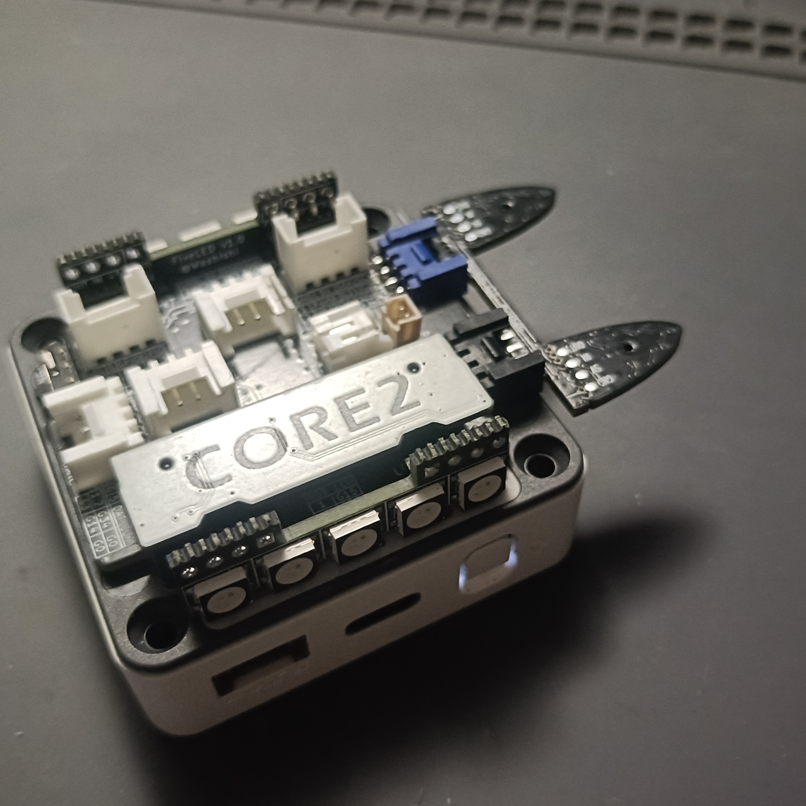
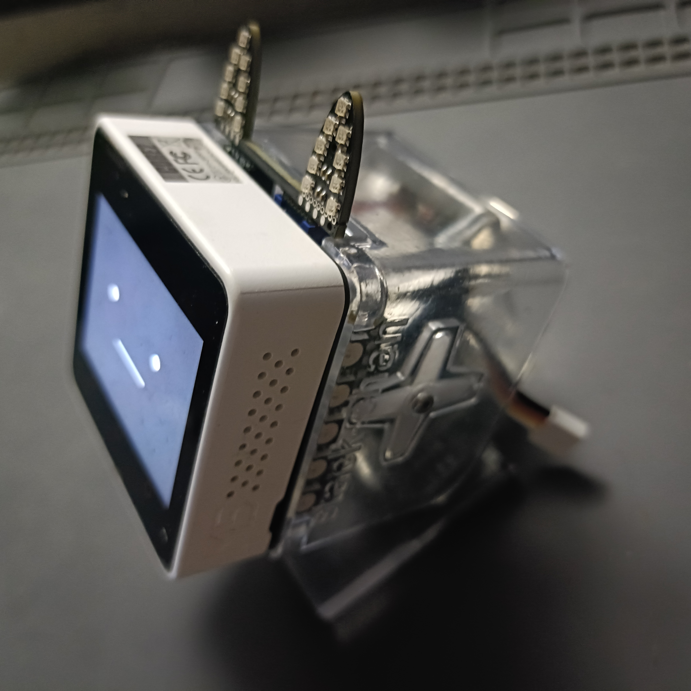
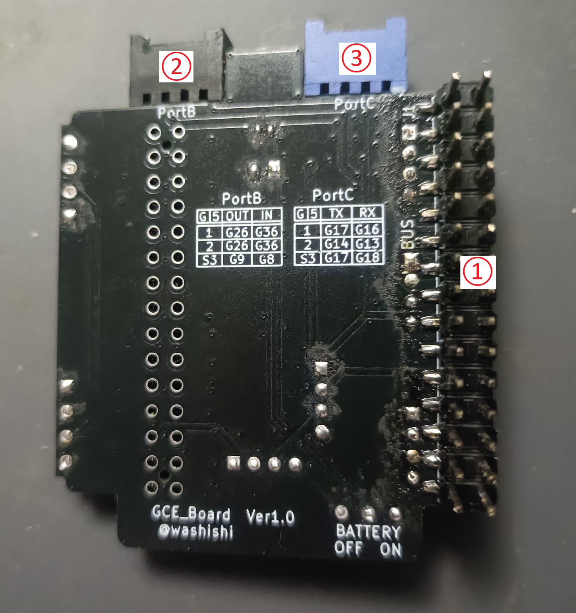
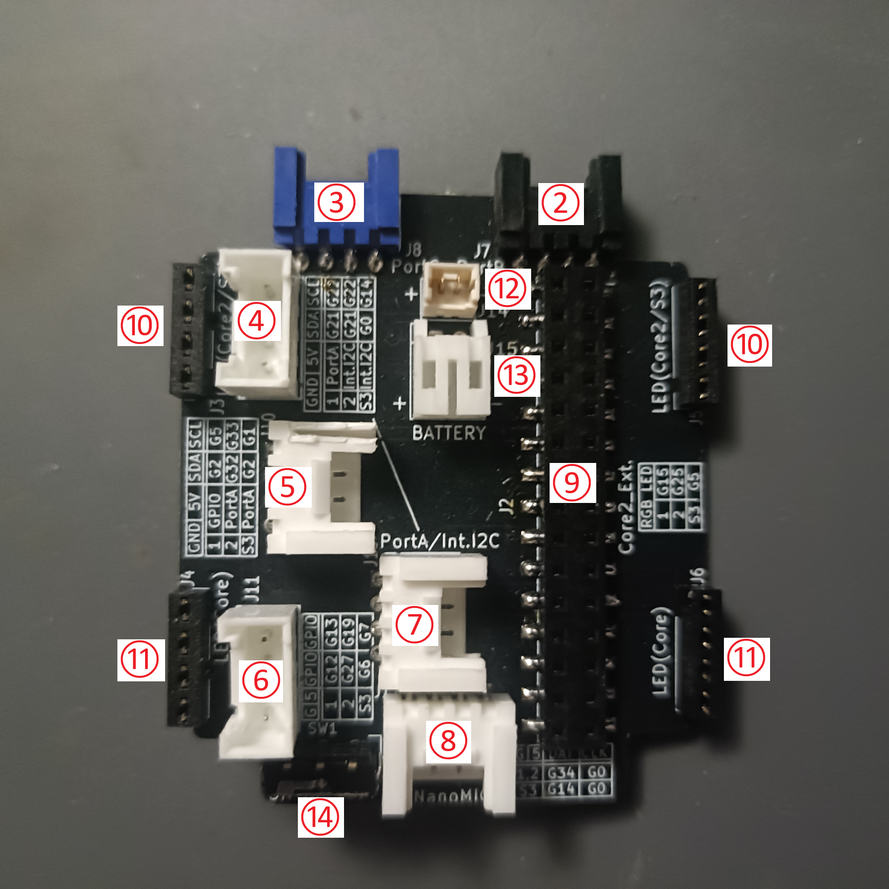

# GCE_Board
A board for growing cat ear LED

## M5Stack Core に [NekomimiLED](https://washishi.booth.pm/items/6764996)を取り付ける為？の基板です  
- CORE2の裏蓋をつけたままこの基板を取り付けることができます  
  (他のCOREやモジュール取り付け時はM-BUSのピンヘッダを切断して長さを短くすることで対応)
- PortB,PortCはコネクタ同士の間隔も含めてGoBottom互換のためNekomimiLEDが取り付けれます
- CORE2に取り付ける場合は取り外したCORE2 Ext.(MIC,IMU)をこの基板上に取り付けて利用することができます
- オプションでRGB LED(左右各5個,合計10個)が取り付け可能  
  (利用するGPIOについてはGoBottom互換)
- [タカオさん版ｽﾀｯｸﾁｬﾝｹｰｽ](https://mongonta.booth.pm/)に取り付けたまま使うことができます  
  (サーボ接続機能はないのでTakaoBaseを併用してください)

   
  
   
   

## 各部の説明

   
  1. M-BUSピンヘッダ M5Coreへ接続します 
　Core2の裏蓋の上に取り付ける場合はそのまま 
　Core2の裏蓋を外す場合や他のCoreやLLM等のモジュールの裏につける場合は 
　付属の治具を使いピンヘッダを丁度よい長さに切断します 
　
 
 
 
  2. PortB GoBotom互換のPortBです 

  |種類|||| 
  | :--- | :--- | :--- | :--- | :--- |
  |Basic系    |GND|5V|GPIO-26|GPIO-36|
  |Core2      |GND|5V|GPIO-26|GPIO-36|
  |CoreS3/S3SE|GND|5V|GPIO-9 |GPIO-8 |
 

  3.PortC GoBotom互換のPortCです  
  |種類|||TX|RX 
  | :--- | :--- | :--- | :--- | :--- |
  |Basic系    |GND|5V|GPIO-17|GPIO-16|
  |Core2      |GND|5V|GPIO-17|GPIO-16|
  |CoreS3/S3SE|GND|5V|GPIO-17|GPIO-18|
 

  4.PortA(BASIC系)/Int I2C(Core2,S3) (縦)  
  |種類|||SCL|DAT| 
  | :--- | :--- | :--- | :--- | :--- | :-- |
  |Basic系    |GND|5V|GPIO-21|GPIO-22|PortA|
  |Core2      |GND|5V|GPIO-21|GPIO-22|Int I2C|
  |CoreS3/S3SE|GND|5V|GPIO-12|GPIO-11|Int I2C| 
 

  5.GPIO(BASIC系)/PortA(Core2,S3) (横)
  |種類|||SCL|DAT| 
  | :--- | :--- | :--- | :--- | :--- | :-- |
  |Basic系    |GND|5V|GPIO-2|GPIO-5|GPIO|
  |Core2      |GND|5V|GPIO-32|GPIO-33|PortA|
  |CoreS3/S3SE|GND|5V|GPIO-2|GPIO-1|PortA| 
 

  6.GPIO (縦)
  |種類|||| 
  | :--- | :--- | :--- | :--- | :--- |
  |Basic系    |GND|5V|GPIO-12|GPIO-13|
  |Core2      |GND|5V|GPIO-27|GPIO-19|
  |CoreS3/S3SE|GND|5V|GPIO-6|GPIO-7| 
 
  
  7.PortA(BASIC系)/Int I2C(Core2,S3) (横)  
　接続は「4.PortA(BASIC系)/Int I2C(Core2,S3) (縦)」と同じです 
　ここに刺せるIMUのオプションを開発中です 
　Greoveコネクタも一応刺せますが刺しにくいです 
 

  8.NanoMIC(PDMマイク)専用コネクタ 
　NanoMICやM5のPDMマイク専用のGroveコネクタです 
  |種類|||I2S DAT|I2S CLK 
  | :--- | :--- | :--- | :--- | :--- |
  |Basic系    |GND|5V|GPIO-34|GPIO-0|
  |Core2      |GND|5V|GPIO-34|GPIO-0|
  |CoreS3/S3SE|GND|5V|GPIO-14|GPIO-0| 
 

  9.Core2 Ext. 専用ピンソケット 
　  Core2付属の Core2 Ext. をここに刺すことにより使えます 
　  注：Core2 Ext.で使用するピンしか接続されていません

  10.LED用ピンソケット(Core2,S3用) 
　オプションのRGB LEDを取り付けるピンソケットです 
　 Core2,CoreS3/S3SE用 GoBottom互換 
  |種類|RGB LED(WS2812B) 
  | :--- | :--- |
  |Core2      |GPIO-25|
  |CoreS3/S3SE|GPIO-5| 
 

  11.LED用ピンソケット(BASIC系用)
　オプションのRGB LEDを取り付けるピンソケットです 
　 BASIC系用 GoBottom互換 
  |種類|RGB LED(WS2812B) 
  | :--- | :--- |
  |BASIC系|GPIO-15|

 
  8. バッテリーコネクタ(小) 
  9. バッテリーコネクタ(大) 
  10. バッテリースイッチ 
 
こちらにバッテリーを繋げるとバッテリースイッチにより
物理的にバッテリーを切り離せるようになります 
利用する場合はバッテリーコネクタ(小)/(大)のいずれかのコネクタに3.7Vのリチウムポリマーバッテリーを +､-があっていることを確認して繋いでください (市販の物で+,-が逆の物があるようです) 
またこちらを利用する場合はCore2の場合は内蔵バッテリーのコネクタは取り外してください  (バッテリーが1つしか繋がっていない状態にしてください) Core2で裏蓋なしで利用する場合は取り外したバッテリーコネクタをこちらに繋ぐこともできます